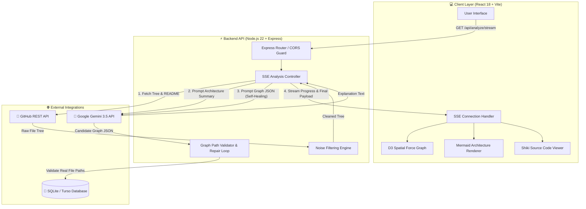

# GitReason 🚀

> **Understand a codebase before you change it.**  
> *GitReason is an enterprise-ready, AI-powered codebase intelligence platform that transforms raw GitHub repositories into interactive multi-layered architecture diagrams, spatial force-directed dependency maps, plain-English system explanations, and syntax-highlighted source code inspection.*

[](https://react.dev/)
[](https://vitejs.dev/)
[](https://nodejs.org/)
[](https://ai.google.dev/)
[](https://tailwindcss.com/)
[](https://turso.tech/)
[](LICENSE)

---

## 📌 Table of Contents

- [Executive Summary](#-executive-summary)
- [Key Features & Capabilities](#-key-features--capabilities)
- [System Architecture & Ingestion Pipeline](#-system-architecture--ingestion-pipeline)
  - [High-Level Dataflow](#high-level-dataflow)
  - [Phase-by-Phase Execution Stream](#phase-by-phase-execution-stream)
  - [Self-Healing & Hallucination-Proof Graph Validation](#self-healing--hallucination-proof-graph-validation)
- [Technical Stack Breakdown](#-technical-stack-breakdown)
- [Local Setup & Developer Guide](#-local-setup--developer-guide)
  - [Prerequisites](#prerequisites)
  - [1. Repository Installation](#1-repository-installation)
  - [2. GitHub OAuth App Configuration](#2-github-oauth-app-configuration)
  - [3. Environment Variables (.env)](#3-environment-variables-env)
  - [4. Running Development Servers](#4-running-development-servers)
- [API Reference & Endpoint Contracts](#-api-reference--endpoint-contracts)
- [Database & Persistence Architecture](#-database--persistence-architecture)
  - [Abstract Repository Pattern](#abstract-repository-pattern)
  - [Database Schema Definitions](#database-schema-definitions)
- [Security & Authentication Engine](#-security--authentication-engine)
- [Deployment & Infrastructure Topology](#-deployment--infrastructure-topology)
- [Project Directory Structure](#-project-directory-structure)
- [Evaluation & Technical Excellence Criteria](#-evaluation--technical-excellence-criteria)
- [Troubleshooting & FAQ](#-troubleshooting--faq)
- [License](#-license)

---

## 🌟 Executive Summary

When developers join a new software project or attempt to refactor unfamiliar software, they spend up to **70% of their time forming a mental model** of the codebase before writing a single line of code. Traditional AI coding tools work line-by-line or snippet-by-snippet inside existing files, failing to convey how components, APIs, databases, microservices, and external integrations connect overall.

**GitReason** bridges this critical gap. By combining real-time GitHub repository ingestion, intelligent noise filtration, LLM architectural reasoning (via Google Gemini 3.5 Flash), zero-trust path validation, and interactive spatial visualization engines (D3.js + Mermaid.js), GitReason provides developers with an instant, interactive mental map of any repository.

---

## ⚡ Key Features & Capabilities

### 1. 🧹 Smart Repository Ingestion & Noise Filtering
Large repositories contain thousands of generated lockfiles, compiled binaries, build outputs, and vendor packages that pollute LLM context windows and lead to high token costs. GitReason's noise filtering engine (`server/noiseFilter.js`) automatically removes:
- **Build Output Directories**: `node_modules`, `dist`, `build`, `.next`, `target`, `vendor`, `.venv`, `__pycache__`, etc.
- **Lock & Cache Files**: `package-lock.json`, `yarn.lock`, `Cargo.lock`, `poetry.lock`, `.DS_Store`, etc.
- **Binary & Media Blobs**: Images (`.png`, `.jpg`, `.svg`), Video/Audio, Fonts (`.woff2`, `.ttf`), Archives (`.zip`, `.tar`), and Compiled Artifacts (`.exe`, `.so`, `.pyc`, `.wasm`).

### 2. 🧠 Plain-English Architectural Reasoning
Produces concise 150-300 word executive summaries outlining system architecture, functional entry points, core domain services, data stores, and overall design patterns.

### 3. 📐 Layered Mermaid Architecture View
Renders structured system boundary diagrams grouped logically into architectural layers (e.g., *API Gateway*, *Application Core*, *Persistence Layer*, *Auth & Security*).

### 4. 🕸️ Interactive D3 Spatial Force Graph
Allows developers to visually explore codebases in 2D space:
- **Force Simulation**: Dynamic node separation, collision prevention, and edge spring dynamics.
- **Interactive Controls**: Pan, zoom, search, node highlight, and group filtering.
- **Local Isolation Mode**: Focus on a single node and isolate its immediate upstream/downstream connections.
- **Blast-Radius Impact Analysis**: Identify all dependent modules affected when modifying a specific file or module.

### 5. 📄 Source Inspection with Syntax Highlighting
Clicking any node in the graph fetches the real file content directly from GitHub and renders it inside an in-app viewer powered by **Shiki** syntax highlighting.

### 6. 🔐 Enterprise OAuth & Session Security
- **GitHub OAuth 2.0**: Authenticate to access private enterprise repositories.
- **AES-256-GCM Token Encryption**: User access tokens are encrypted at rest in the database before storage.
- **Opaque HttpOnly Cookies**: Session management prevents XSS vulnerabilities and client-side token leaks.

### 7. ⚡ Real-Time Server-Sent Events (SSE) Progress Streaming
Analyses stream live status updates (`checking_access` $\rightarrow$ `fetching_tree` $\rightarrow$ `filtering_noise` $\rightarrow$ `reading_readme` $\rightarrow$ `generating_explanation` $\rightarrow$ `generating_graph` $\rightarrow$ `saving` $\rightarrow$ `done`) directly over an HTTP SSE connection with automatic request abortion if the user closes the page.

---

## 🏗️ System Architecture & Ingestion Pipeline

### High-Level Dataflow



---

### Phase-by-Phase Execution Stream

| Step | Stream Event | Action Performed |
| :---: | :--- | :--- |
| **1** | `checking_access` | Verifies repository existence, public visibility, or user OAuth permissions. |
| **2** | `fetching_tree` | Recursively fetches the full repository tree from GitHub REST API (`/git/trees/{sha}`). |
| **3** | `reading_readme` | Fetches raw `README.md` (capped at 4,000 characters) to assist architectural synthesis. |
| **4** | `generating_explanation` | Queries Google Gemini 3.5 Flash for a high-level plain-English architectural summary. |
| **5** | `generating_graph` | Prompts Gemini to construct structured JSON nodes and edges representing architectural components. |
| **6** | `validating_paths` | Runs zero-trust verification checking every generated node against authentic repository paths. |
| **7** | `saving` | Persists completed analysis payload into SQLite/Turso database for instant historical reloading. |
| **8** | `done` | Transmits final payload to the client interface and closes the SSE stream cleanly. |

---

### Self-Healing & Hallucination-Proof Graph Validation

One of GitReason's primary innovations is its **Zero-Trust Graph Validation Loop** (`server/analyze.js`):

1. **Path Verification**: Every node `path` emitted by the LLM is checked against the set of verified file paths present in `filteredTree`.
2. **Self-Healing Retry Loop**: If the LLM produces missing paths, broken edge references, or invalid JSON, GitReason captures the exact error feedback and re-prompts the LLM (up to `MAX_GRAPH_ATTEMPTS = 3`).
3. **Graph Repair Fallback**: If invalid nodes persist on the final attempt, `repairGraph()` automatically strips non-existent nodes while preserving valid nodes and edges, guaranteeing zero client-side crashes.

---

## 🛠️ Technical Stack Breakdown

### Frontend Technologies
| Component | Technology | Purpose |
| :--- | :--- | :--- |
| **Core Framework** | React 18.3 + Vite 8.2 | Fast UI rendering & instant HMR build environment |
| **Spatial Graph** | D3.js (`d3-force`, `d3-zoom`, `d3-selection`) | 2D interactive force-directed graph simulation |
| **Architecture View**| Mermaid.js 11.4 | Dynamic rendering of layered architectural diagrams |
| **Code Highlighting**| Shiki 4.4 | Server-side & client-side syntax highlighting |
| **UI Components** | Base UI + Lucide / Hugeicons | Accessible UI primitives and modern icon sets |
| **Styling** | Tailwind CSS 4.3 + tw-animate-css | Utility-first styling with responsive design tokens |

### Backend Technologies
| Component | Technology | Purpose |
| :--- | :--- | :--- |
| **Runtime** | Node.js 22.x (ESM modules) | High-performance asynchronous execution engine |
| **Server** | Express 4.21 | Lightweight HTTP web server & middleware pipeline |
| **Real-time Engine** | Server-Sent Events (SSE) | Unidirectional event streaming for analysis status |
| **Security** | Crypto (`aes-256-gcm`) | Military-grade token encryption at rest |

### AI & Database Layer
| Component | Technology | Purpose |
| :--- | :--- | :--- |
| **Primary LLM** | Google Gemini 3.5 Flash | High-speed, context-aware architectural reasoning |
| **Secondary LLM** | Hugging Face Serverless API (`Qwen2.5-Coder-32B`) | Fallback open-source model provider |
| **Local Database** | Native `node:sqlite` | Embedded zero-dependency SQL database for development |
| **Remote Database**| Turso (libSQL) | Serverless edge SQL database for production deployments |

---

## 🚀 Local Setup & Developer Guide

### Prerequisites
Before starting, ensure you have installed:
- **Node.js**: `v22.5.0` or higher ([Download Node.js](https://nodejs.org/))
- **Git**: Installed and configured on your system.
- **Gemini API Key**: Free key from [Google AI Studio](https://aistudio.google.com/apikey).

---

### 1. Repository Installation

Clone the repository and install all dependencies:

```bash
git clone https://github.com/auraCodesKM/gitReason.git
cd gitReason

# Install backend dependencies
cd server
npm install

# Install frontend dependencies
cd ../client
npm install
```

---

### 2. GitHub OAuth App Configuration

To enable GitHub login and private repository analysis:

1. Open [GitHub Developer Settings → OAuth Apps](https://github.com/settings/developers).
2. Click **New OAuth App**.
3. Fill in the required fields:
   - **Application Name**: `GitReason Development`
   - **Homepage URL**: `http://localhost:5173`
   - **Authorization Callback URL**: `http://localhost:4000/api/auth/github/callback`
4. Register application, then copy your **Client ID** and click **Generate a new client secret**.

---

### 3. Environment Variables (.env)

Create a `.env` file inside the `server/` directory:

```bash
cd server
cp .env.example .env
```

Fill in the environment variables:

```env
# Server Configuration
NODE_ENV=development
PORT=4000

# GitHub OAuth Credentials
GITHUB_CLIENT_ID=your_github_client_id
GITHUB_CLIENT_SECRET=your_github_client_secret
GITHUB_CALLBACK_URL=http://localhost:4000/api/auth/github/callback
CLIENT_ORIGIN=http://localhost:5173

# Cryptographic Session Secret (At least 32 random characters)
SESSION_SECRET=7f9b8c3d2e1a4b5c6d7e8f9a0b1c2d3e4f5a6b7c8d9e0f1a2b3c4d5e6f7a8b9c

# AI Model Configuration
GEMINI_API_KEY=your_gemini_api_key
GEMINI_MODEL=gemini-3.5-flash

# Database Selection (sqlite for local dev, turso for prod)
DATABASE_PROVIDER=sqlite
```

> 🔐 **Generate Session Secret**:
> ```bash
> node -e "console.log(require('crypto').randomBytes(32).toString('hex'))"
> ```

---

### 4. Running Development Servers

Open two terminal windows to run both servers concurrently:

#### Terminal 1: Backend Express Server
```bash
cd server
npm run dev
```
*Expected Output*: `GitReason server running on port 4000`

#### Terminal 2: Frontend Vite Client
```bash
cd client
npm run dev
```
*Expected Output*: `Local: http://localhost:5173/`

Visit **`http://localhost:5173`** in your browser!

---

## 📡 API Reference & Endpoint Contracts

### System & Health Endpoints

#### `GET /health`
- **Description**: Returns process health and database connection status.
- **Authentication**: None required.
- **Sample Response**:
```json
{
  "status": "ok",
  "database": "ok",
  "environment": "development",
  "version": "0.0.1"
}
```

---

### Analysis & Repository Endpoints

#### `GET /api/repo/check`
- **Description**: Validates repository existence and permissions.
- **Query Parameters**: `repo` (e.g. `expressjs/express`)

#### `GET /api/analyze/stream`
- **Description**: SSE endpoint streaming live analysis progress and returning final graph payload.
- **Query Parameters**: `repo` (e.g. `facebook/react`)
- **SSE Events Emitted**: `phase`, `explanation`, `error`, `done`

#### `GET /api/repo/file`
- **Description**: Retrieves source code for in-app syntax inspection.
- **Query Parameters**: `repo`, `path`, `ref`

---

### Authentication & User Endpoints

| Endpoint | Method | Description | Auth Required |
| :--- | :---: | :--- | :---: |
| `/api/auth/github/start` | `GET` | Initiates GitHub OAuth authentication flow | No |
| `/api/auth/github/callback`| `GET` | Handles OAuth callback and issues session cookie | No |
| `/api/auth/session` | `GET` | Returns active user session info | No |
| `/api/auth/logout` | `POST` | Invalidates session and clears cookies | Yes |
| `/api/user/me` | `GET` | Returns authenticated user details | Yes |
| `/api/user/history` | `GET` | Lists previously saved codebase analyses | Yes |
| `/api/user/history/:id` | `GET` | Fetches cached analysis by ID without re-querying LLM | Yes |

---

## 🗄️ Database & Persistence Architecture

### Abstract Repository Pattern

GitReason implements a decoupled data abstraction layer (`server/db/`). Application code never invokes raw SQL directly; instead, domain repositories (`usersRepo`, `sessionsRepo`, `analysesRepo`) delegate to provider-specific client implementations based on `DATABASE_PROVIDER`:

```text
               ┌────────────────────────┐
               │   Domain Repository    │
               │ (analysesRepo / users) │
               └───────────┬────────────┘
                           │
             ┌─────────────┴─────────────┐
             ▼                           ▼
   ┌───────────────────┐       ┌───────────────────┐
   │ SQLite Provider   │       │ Turso Provider    │
   │ (node:sqlite)     │       │ (@libsql/client)  │
   └───────────────────┘       └───────────────────┘
```

---

### Database Schema Definitions

```sql
-- Users Table
CREATE TABLE IF NOT EXISTS users (
  id INTEGER PRIMARY KEY AUTOINCREMENT,
  github_id INTEGER UNIQUE NOT NULL,
  username TEXT NOT NULL,
  avatar_url TEXT,
  encrypted_token TEXT,
  created_at DATETIME DEFAULT CURRENT_TIMESTAMP
);

-- Sessions Table
CREATE TABLE IF NOT EXISTS sessions (
  id TEXT PRIMARY KEY,
  user_id INTEGER NOT NULL REFERENCES users(id),
  expires_at DATETIME NOT NULL,
  created_at DATETIME DEFAULT CURRENT_TIMESTAMP
);

-- Saved Repository Analyses
CREATE TABLE IF NOT EXISTS analyses (
  id INTEGER PRIMARY KEY AUTOINCREMENT,
  user_id INTEGER NOT NULL REFERENCES users(id),
  repo_full_name TEXT NOT NULL,
  language TEXT,
  status TEXT NOT NULL,
  file_tree JSON NOT NULL,
  explanation TEXT NOT NULL,
  graph JSON NOT NULL,
  created_at DATETIME DEFAULT CURRENT_TIMESTAMP
);
```

---

## 🔐 Security & Authentication Engine

1. **Opaque HttpOnly Session Cookies**:
   Sessions are identified by random 256-bit cryptographically secure hexadecimal strings (`session.js`). Cookies are flagged `HttpOnly`, `SameSite=Lax`, and `Secure` (in production) to block XSS credential theft.
2. **AES-256-GCM Token Encryption at Rest**:
   GitHub access tokens are encrypted using `AES-256-GCM` with a unique initialization vector (IV) and authentication tag before storage in the database.
3. **CORS Whitelist Protection**:
   The backend inspects request origins against the `CLIENT_ORIGIN` environment variable, denying untrusted cross-domain API calls while permitting credentials.

---

## 🌐 Deployment & Infrastructure Topology

```text
       ┌──────────────────────────────┐
       │     Vercel Edge Network      │
       │    (React 18 + Vite SPA)     │
       └──────────────┬───────────────┘
                      │
        HTTPS Requests│ SSE Event Stream
                      ▼
       ┌──────────────────────────────┐
       │   Render Web Service (PaaS)  │
       │    (Node.js 22 + Express)    │
       └──────┬───────────────┬───────┘
              │               │
   Gemini API │               │ libSQL Protocol
              ▼               ▼
    ┌────────────────┐  ┌────────────────┐
    │ Google AI      │  │ Turso Global   │
    │ Studio         │  │ Edge Database  │
    └────────────────┘  └────────────────┘
```

---

## 📁 Project Directory Structure

```text
gitReason/
├── client/                         # Frontend Application Source
│   ├── src/
│   │   ├── components/             # UI Components, Modals, & Navbars
│   │   ├── graph/                  # D3.js Force Simulation & Graph Logic
│   │   │   ├── CodebaseGraph.jsx   # Interactive D3 spatial canvas
│   │   │   └── GraphControls.jsx   # Zoom, Filter, & Search controls
│   │   ├── lib/                    # API client, SSE hook, state handlers
│   │   ├── pages/                  # Page Views (Home, Analyze, Sign, Privacy)
│   │   └── sections/               # Modular landing page sections
│   ├── dist/                       # Compiled production web bundle
│   ├── package.json
│   └── vite.config.js              # Vite server & proxy configuration
│
├── server/                         # Backend Application Source
│   ├── db/                         # Data Access Layer & DB Drivers
│   │   ├── repository/             # Domain repos (users, sessions, analyses)
│   │   ├── client.js               # Dynamic DB Client Switcher
│   │   ├── schema.js               # Shared Database Schema DDL
│   │   ├── sqlite.js               # Native Node.js SQLite adapter
│   │   └── turso.js                # Turso libSQL edge adapter
│   ├── scripts/                    # Helper scripts & JSON seed fixtures
│   ├── analyze.js                  # SSE stream analysis controller & validator
│   ├── auth.js                     # GitHub OAuth PKCE & Token Encrypter
│   ├── github.js                   # GitHub REST API client wrapper
│   ├── llm.js                      # LLM Provider Layer (Gemini / Hugging Face)
│   ├── noiseFilter.js              # Repository file tree noise reduction
│   ├── server.js                   # Express application entry point
│   ├── session.js                  # Session cookie management
│   └── package.json
│
└── README.md                       # Comprehensive Project Documentation
```

---

## 🏆 Evaluation & Technical Excellence Criteria

If you are assessing **GitReason** for technical evaluation or code review, key architectural highlights include:

1. **Hallucination-Proof Graph Validation**: Rejects LLM-invented file paths via a self-healing 3-attempt validation loop (`server/analyze.js`) backed by an automated path repair fallback.
2. **Zero-Dependency Native Database Integration**: Utilizes Node 22's native `node:sqlite` driver locally, eliminating native binary compilation issues (`node-gyp`) during local developer onboarding.
3. **Resilient Real-Time Event Architecture**: Server-Sent Events (SSE) include client disconnect listeners (`req.on('close')`), automatically aborting downstream LLM requests to prevent API quota consumption.
4. **Production Security Best Practices**: Zero plain-text token storage (AES-256-GCM encrypted), HttpOnly session isolation, and explicit CORS origin checks.

---

## ❓ Troubleshooting & FAQ

<details>
<summary><b>Q: I get "SESSION_SECRET is not set" when starting the server.</b></summary>
<p>Make sure you have copied <code>server/.env.example</code> to <code>server/.env</code> and populated <code>SESSION_SECRET</code> with a 32+ character random secret string.</p>
</details>

<details>
<summary><b>Q: Why does local development use SQLite without installing sqlite3 npm package?</b></summary>
<p>GitReason takes advantage of Node.js 22's built-in <code>node:sqlite</code> module, providing native SQL database capabilities out of the box with zero external dependencies.</p>
</details>

<details>
<summary><b>Q: Can I analyze private GitHub repositories?</b></summary>
<p>Yes! Simply sign in with GitHub using the "Sign In" button on the navbar. GitReason uses OAuth permissions to fetch your private repository trees securely without exposing your credentials.</p>
</details>

---

## 📄 License

Distributed under the **MIT License**. See `LICENSE` for details.

---

<p align="center">
  <b>GitReason — Map the system. Understand what you're changing.</b>
</p>
